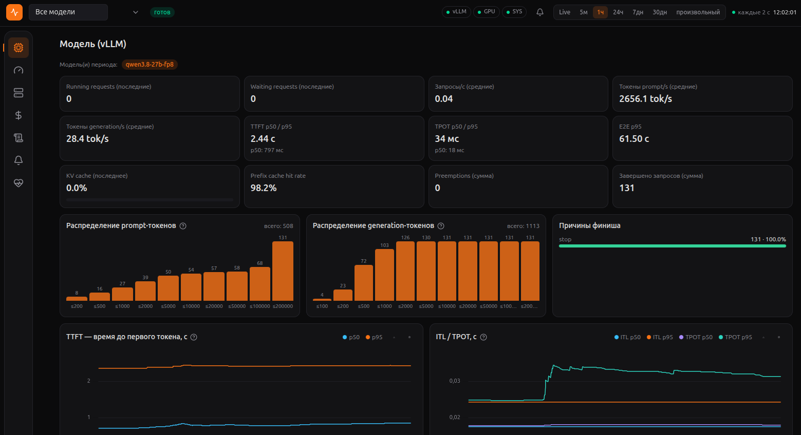

# llm-metrics — веб-мониторинг vLLM-сервера



Панель мониторинга vLLM-инференса: загрузка GPU, латентность (TTFT/TPOT/ITL/E2E),
throughput, KV-кэш, стоимость (токены + электричество), логи vLLM и алерты
(в т.ч. в Telegram).

**Стек:** FastAPI (`api/`) + Next.js/TS/Tailwind (`web/`), SQLite WAL + Alembic,
uPlot-графики. API и UI — в `docs/`.

## Возможности

| Вкладка | Что показывает |
|---|---|
| **Модель (vLLM)** | running/waiting, prompt/generation tok/s, TTFT/TPOT/ITL/E2E p50/p95, KV-кэш, prefix-cache, финиш-причины, распределения длин запросов; фильтр по модели (смена модели — отдельная история) |
| **GPU** | мощность, утилизация, VRAM, температура, частоты — по каждой GPU хоста (NVML) |
| **Система** | CPU (общий/по ядрам), RAM, swap, disk I/O, сеть, steal, частота, psi, диски |
| **Стоимость** | стоимость по тарифам (prompt/completion + электричество), средний день, прогноз на месяц, «к платёжке»; тарифы версионируются, история пересчитывается |
| **Логи** | строки vLLM-лога с фильтрами и мини-графиком по дням |
| **Алерты** | правила по метрикам/статусам, журнал, Telegram-уведомления |

Режимы: Live (SSE, ~2-5 с) и периоды 5м / 1ч / 24ч / 7д / 30д (агрегаты
hourly/daily). Сбой источника не роняет остальные — на графике разрыв, не 0.

## Документация

* [`docs/DEPLOY.md`](docs/DEPLOY.md) — установка и запуск: nvidia-container-toolkit,
  docker compose, vLLM на хосте, Telegram-алерты, перенос, эксплуатация;
* [`docs/CONFIG.md`](docs/CONFIG.md) — конфигурация (все переменные `.env`)
  и примеры хост-скриптов запуска vLLM;
* [`docs/api-contracts.md`](docs/api-contracts.md) — API-контракты
  (`/api/live`, `/api/metrics`, `/api/model`, `/api/cost`, SSE);
* [`docs/vllm-metrics-sample.txt`](docs/vllm-metrics-sample.txt) — образец
  `/metrics` vLLM (исходная выборка метрик).

## Быстрый старт

```bash
# Сервер с vLLM (подробно — docs/DEPLOY.md):
git clone <repo-url> llm-metrics && cd llm-metrics
cp .env.example .env && $EDITOR .env   # VLLM_URL, VLLM_SCRIPT, VLLM_LOG_DIR, тарифы
make build            # образы api + web
make vllm-start       # vLLM на хосте (nohup, лог → $VLLM_LOG_DIR/vllm.log)
make start            # api + web (наружу только web :3000)
curl -s http://127.0.0.1:3000/api/health
```

Dev (без docker): `make dev-api` (uvicorn :8100) + `make dev-web` (:3000),
мок vLLM — `make mock-vllm`. Тесты: `make test-api`; web — `cd web && npm run build`.

## Архитектура (кратко)

* **vLLM — процесс на хосте** (`--host 0.0.0.0:8000`, свой скрипт, пример —
  `docs/CONFIG.md`); не знает про мониторинг.
* **api** (в docker, 8100 наружу не открыт): коллекторы vLLM
  (`host.docker.internal:8000`), NVML (все GPU хоста), лог-тейлер (bind-ro),
  SQLite, агрегатор hourly/daily, стоимость, алерты.
* **web** (Next.js, :3000): UI + rewrite `/api/*` на api.
* БД — `./data/metrics.db` (WAL); бэкап = копия файла.
